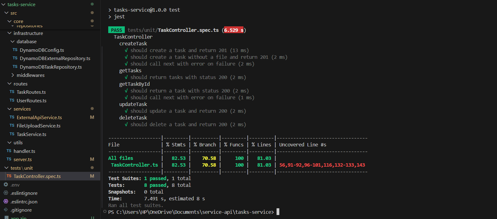
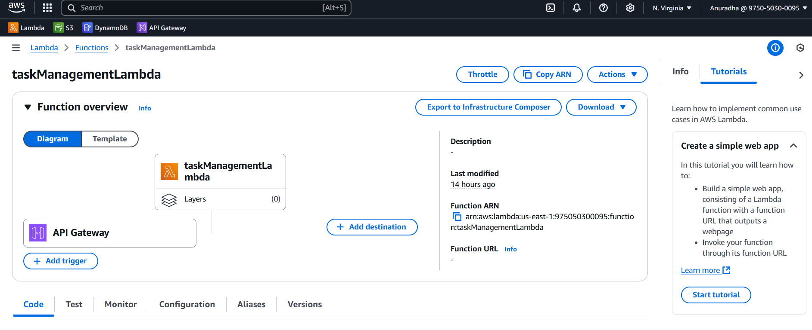
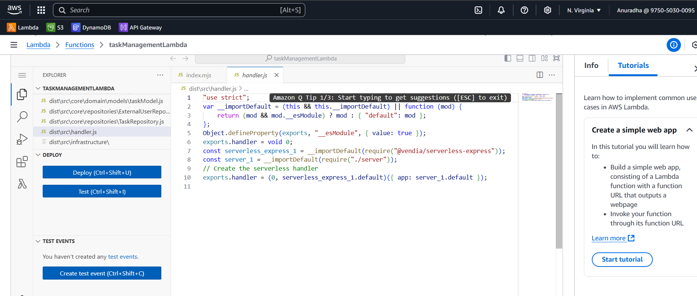
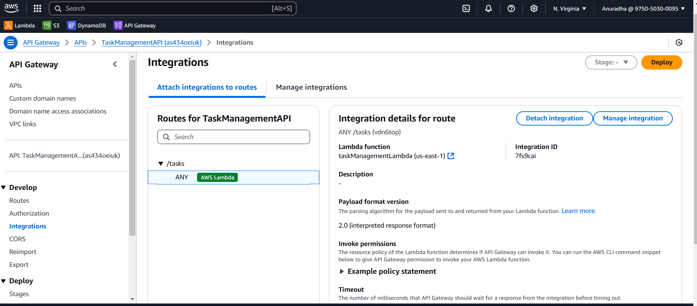

# Task Management System API

Built using **Express.js** and **TypeScript**, it adheres to **Hexagonal Architecture** and **SOLID principles** to ensure maintainability and extensibility.

---

## Requirements

To run this project locally, ensure you have the following installed:

- **Node.js**: v18 or higher
- **npm** or **Yarn**: Latest version
- **TypeScript**: Globally installed if running `ts-node` outside of this project

## Features

- **Task Management**: Create, read, update, and delete tasks with fields like UUID, title, description, status, and timestamps.
- **Scalability**: Designed using microservices to handle high traffic and concurrent requests.
- **AWS Integration**: Stores files in S3, caches data using DynamoDB with TTL.
- **Robust Validation**: Implements input validation and error handling.
- **Extensibility**: Follows Hexagonal Architecture principles for easily adding new features.

---

## Technologies Used

- **Backend**: Node.js (Express.js, TypeScript)
- **Database**: DynamoDB
- **Caching**: DynamoDB with TTL
- **Storage**: AWS S3
- **Architecture**: Hexagonal Architecture, SOLID principles
- **Cloud Services**: AWS SDK v3

---

## Project Structure

- **controllers/**: Contains business logic.
- **core/repositories**: Contains task and external api repositories.
- **core/domain**: Contains task entities.
- **services/**: Implements application-level services.
- **infrastructure/database**: Manages database connections and operations.
- **infrastructure/middlewares**: Custom middlewares for request error handling and validation.
- **routes**: Defines the API endpoints and controllers.
- **tests**: unit testing
- **config**: Defines environment variables

## Endpoints

### Task Endpoints

| Method | Endpoint | Description              |
| ------ | -------- | ------------------------ |
| POST   | `/`      | Create a new task        |
| GET    | `/`      | Retrieve all tasks       |
| GET    | `/:id`   | Retrieve a specific task |
| PUT    | `/:id`   | Update an existing task  |
| DELETE | `/:id`   | Delete a task            |

---

## Installation

1. Clone the repository:

   ```bash
   git clone git@github.com:anudissanayake/task-management-technical-assessment.git
   cd tasks-service

   ```

2. Install dependencies:
   npm install

3. Set up environment variables:
   PORT=3000
   AWS_REGION=us-east-1
   DYNAMO_TASK_TABLE_NAME=Tasks
   S3_BUCKET_NAME=task-file-bucket
   DYNAMO_USER_TABLE_NAME=UserCache

4. Run the development server:
   npm run dev

5. Run the test:
   npm test

   

## Deployment

This project is deployed using **AWS Lambda** and **API Gateway** to ensure a serverless architecture.






